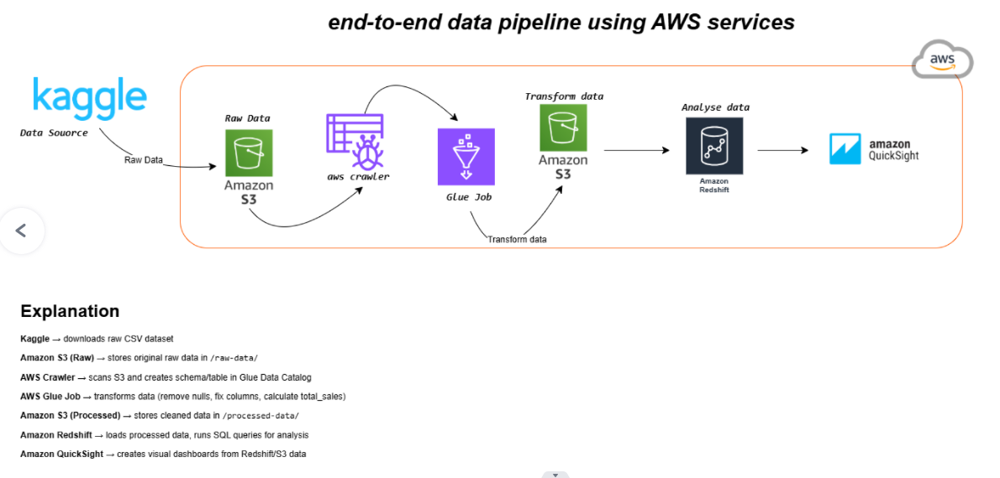

# Bootcamp Task 1 - AWS Data Pipeline with QuickSight Visualization

A complete data engineering pipeline that processes sales data using AWS services and creates interactive visualizations with Amazon QuickSight.

## Architecture



## Project Overview

This project implements a serverless data pipeline on AWS that:
1. Stores raw sales data in Amazon S3
2. Catalogs data using AWS Glue Crawler
3. Processes and transforms data with AWS Glue ETL jobs
4. Loads data into Amazon RedShift for analytics
5. Visualizes insights using Amazon QuickSight

## Technologies Used

- **Amazon S3**: Raw data storage
- **AWS Glue Crawler**: Automatic schema discovery and data cataloging
- **AWS Glue ETL**: Data transformation and processing
- **Amazon RedShift**: Data warehouse for analytics
- **Amazon QuickSight**: Business intelligence and visualization

## Data Pipeline Flow

1. **Data Ingestion**: Raw sales data uploaded to S3 bucket
2. **Data Cataloging**: Glue Crawler scans S3 and creates metadata tables
3. **ETL Processing**: Glue ETL job transforms and cleans the data
4. **Data Loading**: Processed data loaded into RedShift tables
5. **Visualization**: QuickSight connects to RedShift for dashboard creation

## SQL Queries

The project includes analytical queries in `RedShift-sql.sql`:

- **Total Records**: Count of all sales transactions
- **Total Revenue**: Sum of all sales
- **Top 5 Products**: Best-selling products by revenue
- **Monthly Sales Summary**: Aggregated sales metrics by month
- **Average Order Value**: Mean transaction value

## Key Features

- Automated data discovery and cataloging
- Scalable ETL processing
- Columnar data storage in RedShift
- Interactive dashboards and charts
- Real-time query performance

## Screenshots

The project includes screenshots demonstrating:
- S3 bucket structure (`S3-ss.png`)
- Glue Crawler configuration (`Crawler-ss.png`)
- Glue ETL job execution (`Glue-ETL-Job-ss.png`)
- RedShift database tables (`RedShift-ss.png`, `database-ss.png`)
- QuickSight visualizations (`QuickSide-Charts.pdf`)

## Sample Queries

```sql
-- Total Revenue
SELECT SUM(total_sales) FROM dev.public.sales_data;

-- Top 5 Products
SELECT product_id, SUM(total_sales) AS total
FROM dev.public.sales_data
GROUP BY product_id
ORDER BY total DESC
LIMIT 5;

-- Monthly Sales Summary
SELECT
    EXTRACT(MONTH FROM date) as month,
    COUNT(*) AS total_orders,
    SUM(total_sales) AS total_revenue,
    AVG(total_sales) AS avg_order_value
FROM dev.public.sales_data
GROUP BY EXTRACT(MONTH FROM date)
ORDER BY month;
```

## Learning Outcomes

- Understanding AWS serverless data pipeline architecture
- Working with AWS Glue for ETL operations
- Data warehousing concepts with RedShift
- Creating business intelligence dashboards
- SQL query optimization for analytics

---

**Part of Saylani Bootcamp 4 - Data Engineering Track**
