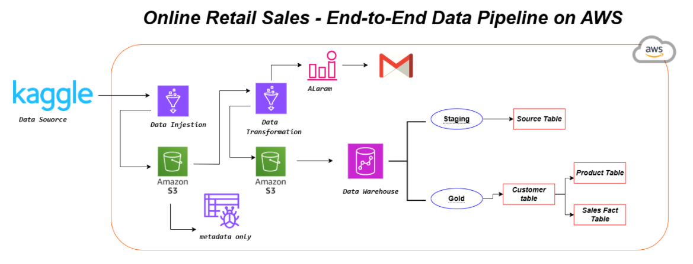

# Bootcamp Task 2 - Advanced ETL Pipeline with Data Orchestration

An advanced data engineering pipeline featuring automated data ingestion from Kaggle, comprehensive ETL processing, normalized data modeling, and workflow orchestration using AWS services.

## Architecture



## Project Overview

This project implements a production-grade data pipeline that:
1. Automatically ingests data from Kaggle using the Kaggle API
2. Stores raw data in Amazon S3
3. Transforms and cleans data using AWS Glue with PySpark
4. Implements a normalized star schema in Amazon RedShift
5. Orchestrates the entire workflow using AWS Step Functions
6. Monitors pipeline health with CloudWatch alarms

## Technologies Used

- **Kaggle API**: Automated dataset download
- **Amazon S3**: Data lake storage (raw and processed data)
- **AWS Glue**: Serverless ETL processing with PySpark
- **Amazon RedShift**: Data warehouse with optimized schema
- **AWS Step Functions**: Workflow orchestration
- **Amazon CloudWatch**: Monitoring and alerting
- **Python/PySpark**: Data transformation logic

## Pipeline Architecture

### 1. Data Ingestion (`DataInjestion.py`)
- Fetches online retail dataset from Kaggle
- Loads data using Kaggle API
- Uploads raw CSV to S3 bucket
- Handles Kaggle authentication securely

### 2. Data Transformation (`Transformation.py`)
- **Data Cleaning**:
  - Standardizes column names
  - Removes duplicates
  - Handles null values
  - Filters outliers (negative quantities/prices)
- **Data Type Conversion**:
  - Proper type casting for numeric fields
  - Timestamp formatting for RedShift compatibility
- **Feature Engineering**:
  - Calculates `total_sales` (quantity × unit price)
  - Handles missing customer IDs
- **Data Quality Checks**:
  - Validates critical fields
  - Ensures data integrity
  - Fails pipeline if quality thresholds not met
- **Output**: Tab-separated files to avoid delimiter conflicts

### 3. Data Modeling (`SQLQuery.sql`)

Implements a **Star Schema** with normalized tables:

#### Dimension Tables
- **customers**: Customer information (customerid, country)
  - Distribution key: customerid
- **products**: Product catalog (stockcode, description, unitprice)
  - Sort key: stockcode

#### Fact Table
- **sales_transactions**: Transaction records
  - Foreign keys to customers and products
  - Distribution key: customerid
  - Sort key: invoicedate

### 4. Workflow Orchestration
- **AWS Step Functions**: Coordinates multi-step pipeline
- **Sequential Execution**: Ingestion → Transformation → Loading
- **Error Handling**: Automatic retries and failure notifications

### 5. Monitoring & Optimization
- **CloudWatch Alarms**: Pipeline health monitoring
- **Performance Optimization**:
  - Distribution keys for parallel processing
  - Sort keys for query optimization
  - EXPLAIN query analysis

## Project Structure

```
Bootcamp-task2/
├── Architecture.png                    # Pipeline architecture diagram
├── ProjectDocumentation.docx          # Detailed documentation
├── Scripts/
│   ├── DataInjestion.py              # Kaggle data ingestion
│   ├── Transformation.py             # PySpark ETL logic
│   └── SQLQuery.sql                  # RedShift schema & queries
└── ScreenShorts/
    ├── DataInjestion-ss.png          # Ingestion job execution
    ├── Transformation-ss.png         # Transformation job logs
    ├── Loading-ss.png                # Data loading process
    ├── OrchestrationWorkflow.png     # Step Functions workflow
    ├── Redshift-ss.png               # RedShift tables
    ├── MetaData-ss.png               # Glue Data Catalog
    ├── alarm-ss.png                  # CloudWatch alarms
    └── performance-optimization-explain.png  # Query optimization
```

## Key Features

### Data Quality Assurance
- Automated validation checks
- Null value handling
- Outlier detection and removal
- Duplicate record elimination

### Performance Optimization
- Distribution keys for parallel query execution
- Sort keys for efficient data retrieval
- Columnar storage in RedShift
- Query performance analysis with EXPLAIN

### Scalability
- Serverless architecture (AWS Glue)
- Auto-scaling compute resources
- Partitioned data storage
- Optimized data formats

### Reliability
- Workflow orchestration with Step Functions
- CloudWatch monitoring and alerting
- Data quality gates
- Error handling and retries

## Sample Queries

```sql
-- Customer count
SELECT COUNT(*) FROM gold.customers;

-- Product catalog
SELECT * FROM gold.products;

-- Transaction volume
SELECT COUNT(*) FROM gold.sales_transactions;
```

## Data Flow

1. **Ingestion**: Kaggle → S3 (raw-data/)
2. **Transformation**: S3 (raw-data/) → Glue ETL → S3 (processed-data/)
3. **Loading**: S3 (processed-data/) → RedShift (staging) → RedShift (gold)
4. **Orchestration**: Step Functions manages the entire workflow
5. **Monitoring**: CloudWatch tracks job status and performance

## Learning Outcomes

- Building production-grade ETL pipelines
- Working with external APIs (Kaggle)
- Advanced PySpark transformations
- Data modeling with star schema
- Workflow orchestration patterns
- Performance tuning in RedShift
- Cloud monitoring and alerting
- Data quality validation strategies

## Dataset

**Source**: [Online Retail Dataset](https://www.kaggle.com/datasets/ulrikthygepedersen/online-retail-dataset) from Kaggle

**Description**: Transactional data from an online retail store containing invoice details, products, quantities, prices, and customer information.

---

**Part of Saylani Bootcamp 4 - Data Engineering Track**

**Note**: Kaggle credentials have been masked for security purposes.
