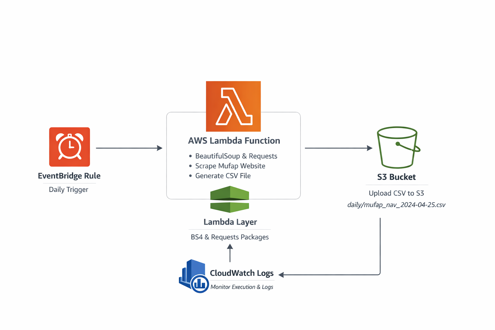

# Bootcamp Task 4 - Automated Web Scraping with AWS Lambda

A serverless web scraping solution that automatically extracts mutual fund NAV (Net Asset Value) data from MUFAP (Mutual Funds Association of Pakistan) website daily and stores it in Amazon S3.

## Architecture



## Project Overview

This project implements a fully automated, serverless web scraping pipeline that:
1. Scrapes mutual fund NAV data from MUFAP website daily
2. Parses HTML tables using BeautifulSoup
3. Converts data to CSV format
4. Stores CSV files in Amazon S3 with date-based naming
5. Runs automatically on a daily schedule using EventBridge

## Technologies Used

- **AWS Lambda**: Serverless compute for running scraping code
- **Lambda Layers**: Package external libraries (BeautifulSoup4, requests)
- **Amazon S3**: Storage for scraped CSV files
- **Amazon EventBridge (CloudWatch Events)**: Daily scheduling
- **Python Libraries**:
  - `requests`: HTTP requests to fetch web pages
  - `BeautifulSoup4`: HTML parsing and data extraction
  - `boto3`: AWS SDK for S3 uploads
  - `csv`: CSV file generation

## Data Source

**URL**: https://www.mufap.com.pk/Industry/IndustryStatDaily?tab=3

**Description**: Daily Net Asset Value (NAV) statistics for mutual funds in Pakistan, including fund names, NAV per unit, and other financial metrics.

## Project Structure

```
bootcamp-task4/
├── Diagram.png                        # Architecture diagram
├── lambda.py                          # Lambda function code
├── mufap_nav_2026-03-03.csv          # Sample output CSV
└── ScreenShorts/
    ├── EventBridge.png               # Scheduling configuration
    ├── S3.png                        # S3 bucket with data
    └── lambda-layer.png              # Lambda layer setup
```

## Setup Instructions

### 1. Local Setup - Create Lambda Layer

Create a folder for Python dependencies:
```bash
mkdir python
```

Install required libraries into the folder:
```bash
pip install beautifulsoup4 requests -t python/
```

### 2. Zip the Layer

Package the dependencies:
```bash
zip -r bs_layer.zip python
```

### 3. Create Lambda Layer

1. Go to AWS Lambda Console → Layers
2. Click "Create Layer"
3. Upload `bs_layer.zip`
4. Select Python runtime (e.g., Python 3.9+)
5. Create the layer

### 4. Create Lambda Function

1. Go to AWS Lambda Console → Functions
2. Click "Create Function"
3. Choose "Author from scratch"
4. Configure:
   - Function name: `mufap-scraper`
   - Runtime: Python 3.9 (or later)
   - Architecture: x86_64
5. Create function

### 5. Attach Lambda Layer

1. In your Lambda function, scroll to "Layers"
2. Click "Add a layer"
3. Choose "Custom layers"
4. Select your `bs_layer` and version
5. Add layer

### 6. Configure Lambda Function

**Add Environment Variable**:
- Key: `S3_BUCKET_NAME`
- Value: `mufap-scraper-data` (or your bucket name)

**Increase Timeout**:
- Configuration → General configuration → Edit
- Set timeout to 30 seconds (default 3s may be too short)

**Add S3 Permissions**:
- Configuration → Permissions → Execution role
- Attach policy: `AmazonS3FullAccess` (or create custom policy)

### 7. Deploy Lambda Code

Copy the code from `lambda.py` and paste it into the Lambda function editor, then deploy.

### 8. Create S3 Bucket

```bash
aws s3 mb s3://mufap-scraper-data
```

Or create via AWS Console with a `daily/` folder structure.

### 9. Test Function

1. Click "Test" in Lambda console
2. Create a test event (use default template)
3. Run the test
4. Verify CSV appears in S3 bucket

### 10. Schedule with EventBridge

1. Go to Amazon EventBridge → Rules
2. Click "Create rule"
3. Configure:
   - Name: `daily-mufap-scraper`
   - Rule type: Schedule
   - Schedule pattern: Cron expression
   - Cron: `0 6 * * ? *` (runs daily at 6 AM UTC)
4. Select target: Lambda function
5. Choose your `mufap-scraper` function
6. Create rule

## Lambda Function Explanation

### Code Walkthrough (`lambda.py`)

```python
def lambda_handler(event, context):
```

**1. Fetch Web Page**
```python
url = 'https://www.mufap.com.pk/Industry/IndustryStatDaily?tab=3'
response = requests.get(url)
response.raise_for_status()
```
- Sends HTTP GET request to MUFAP website
- Raises exception if request fails

**2. Parse HTML Table**
```python
soup = BeautifulSoup(response.text, 'html.parser')
table = soup.select_one('table')
headers = [th.text.strip() for th in table.select('thead th')]
```
- Uses BeautifulSoup to parse HTML
- Extracts table headers from `<thead>`

**3. Extract Data Rows**
```python
for row in table.select('tbody tr'):
    cells = row.find_all('td')
    row_data = {headers[i]: cells[i].text.strip() for i in range(len(cells))}
    data.append(row_data)
```
- Iterates through table rows
- Creates dictionary for each row with header-value pairs

**4. Save to CSV**
```python
today = datetime.now().strftime('%Y-%m-%d')
filename = f'mufap_nav_{today}.csv'
local_path = f'/tmp/{filename}'
with open(local_path, 'w', newline='', encoding='utf-8') as f:
    writer = csv.DictWriter(f, fieldnames=headers)
    writer.writeheader()
    writer.writerows(data)
```
- Generates date-based filename
- Saves to `/tmp/` (Lambda's temporary storage)
- Uses CSV DictWriter for structured output

**5. Upload to S3**
```python
s3 = boto3.client('s3')
s3_path = f'daily/{filename}'
s3.upload_file(local_path, S3_BUCKET, s3_path)
```
- Uploads CSV from `/tmp/` to S3 bucket
- Organizes files in `daily/` folder

**6. Return Response**
```python
return {
    'statusCode': 200,
    'body': json.dumps({'rows': len(data), 's3_path': f's3://{S3_BUCKET}/{s3_path}'})
}
```
- Returns success status with row count and S3 path

## Key Features

### Serverless Architecture
- No server management required
- Pay only for execution time
- Auto-scaling built-in

### Automated Scheduling
- Runs daily without manual intervention
- EventBridge triggers Lambda function
- Reliable and consistent execution

### Data Persistence
- CSV files stored in S3 with date-based naming
- Historical data preserved
- Easy to access and analyze

### Error Handling
- Try-catch block for exception handling
- HTTP status validation
- Returns error details in response

### Scalability
- Lambda handles concurrent executions
- S3 provides unlimited storage
- No infrastructure bottlenecks

## Sample Output

**Filename**: `mufap_nav_2026-03-03.csv`

The CSV contains columns such as:
- Fund Name
- NAV (Net Asset Value)
- NAV Date
- Offer Price
- Repurchase Price
- And other mutual fund metrics

## Scheduling Details

**EventBridge Cron Expression**: `0 6 * * ? *`

- Runs daily at 6:00 AM UTC
- Ensures fresh data is captured every day
- Can be adjusted to any frequency (hourly, weekly, etc.)

## Cost Optimization

- **Lambda**: Free tier includes 1M requests/month
- **S3**: Pay only for storage used
- **EventBridge**: Free for scheduled rules
- **Estimated Cost**: ~$0.01/month for daily scraping

## Monitoring & Verification

### Check Lambda Logs
```bash
aws logs tail /aws/lambda/mufap-scraper --follow
```

### Verify S3 Files
```bash
aws s3 ls s3://mufap-scraper-data/daily/
```

### CloudWatch Metrics
- Monitor Lambda invocations
- Track error rates
- View execution duration

## Screenshots

The project includes screenshots demonstrating:
- **EventBridge.png**: Daily scheduling configuration
- **S3.png**: S3 bucket with scraped CSV files
- **lambda-layer.png**: Lambda layer setup with dependencies

## Use Cases

- **Financial Analysis**: Track mutual fund performance over time
- **Data Warehousing**: Feed data into analytics platforms
- **Automated Reporting**: Generate daily reports for stakeholders
- **Historical Tracking**: Build time-series datasets
- **API Development**: Use S3 data as backend for APIs

## Learning Outcomes

- Building serverless web scraping solutions
- Working with AWS Lambda and Lambda Layers
- Packaging Python dependencies for Lambda
- HTML parsing with BeautifulSoup
- Automated scheduling with EventBridge
- S3 file operations with boto3
- Error handling in serverless functions
- Cost-effective data collection strategies

## Troubleshooting

### Lambda Timeout
- Increase timeout in Configuration → General configuration
- Default 3s may be insufficient for web requests

### Import Errors
- Verify Lambda Layer is attached
- Check layer compatibility with Python runtime

### S3 Permission Denied
- Add S3 write permissions to Lambda execution role
- Verify bucket name in environment variable

### No Data Scraped
- Check if website structure changed
- Verify CSS selectors in BeautifulSoup code
- Test URL accessibility from Lambda

## Future Enhancements

- Add data validation and quality checks
- Implement retry logic for failed requests
- Send SNS notifications on errors
- Store data in DynamoDB for querying
- Create API Gateway endpoint for on-demand scraping
- Add data transformation before storage

---

**Part of Saylani Bootcamp 4 - Data Engineering Track**

**Note**: This project demonstrates serverless data collection patterns using AWS Lambda for automated, cost-effective web scraping.
